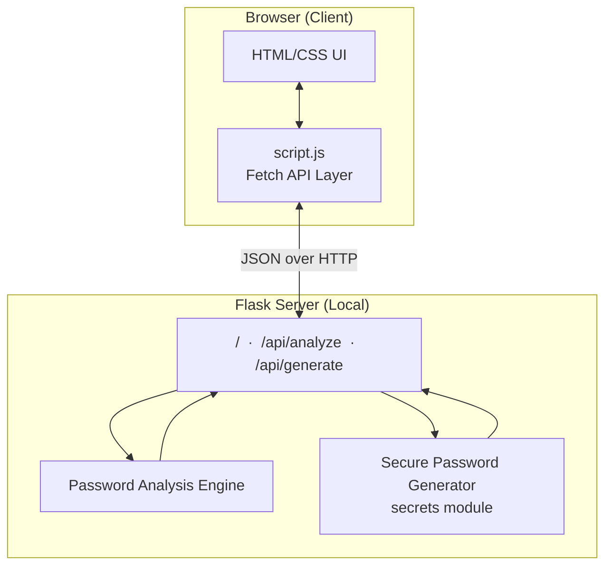
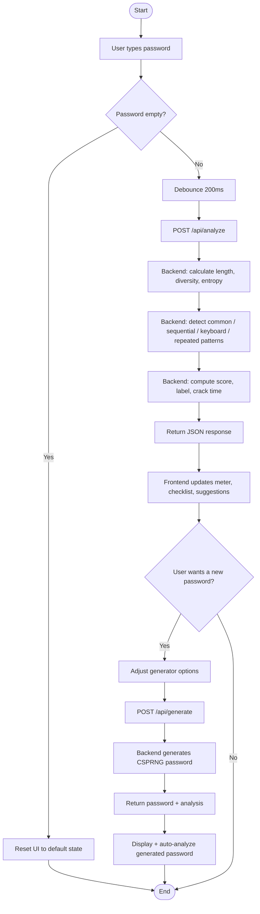
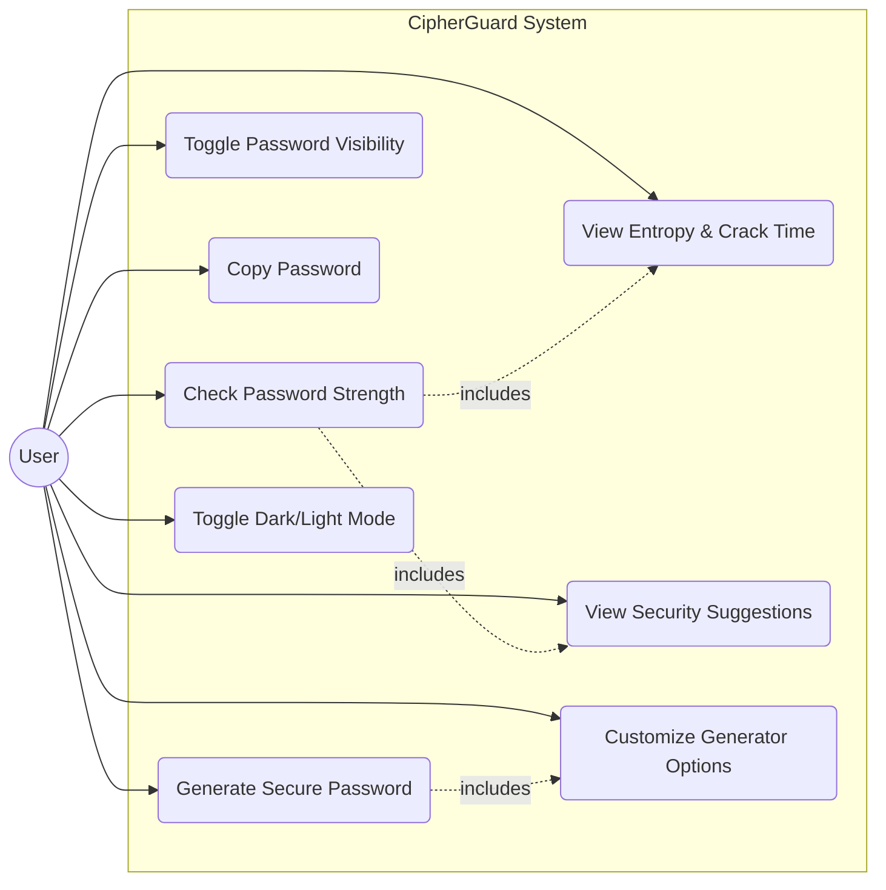
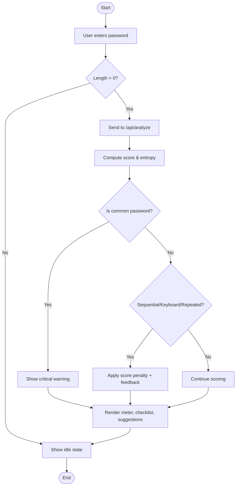

# 🛡️ CipherGuard — Password Strength Checker

Live Demo: https://password-strength-checker-qnae.onrender.com

A complete, production-quality final-year Computer Science project that analyzes
password strength in real time, detects security vulnerabilities, and generates
cryptographically secure passwords — all running **100% locally** with **no
database and no paid APIs**.


---

## 📖 Table of Contents

1. [Project Abstract](#-project-abstract)
2. [Introduction](#-introduction)
3. [Objectives](#-objectives)
4. [Features](#-features)
5. [Tech Stack](#-tech-stack)
6. [Project Structure](#-project-structure)
7. [Modules](#-modules)
8. [System Architecture](#-system-architecture)
9. [Flowchart](#-flowchart)
10. [Use Case Diagram](#-use-case-diagram)
11. [Activity Diagram](#-activity-diagram)
12. [Installation Guide](#-installation-guide)
13. [API Reference](#-api-reference)
14. [Testing](#-testing)
15. [Output Screens](#-output-screens)
16. [Conclusion](#-conclusion)
17. [Future Scope](#-future-scope)
18. [Viva Questions & Answers](#-viva-questions--answers)
19. [License](#-license)

---

## 📝 Project Abstract

Passwords remain the most common form of digital authentication, yet the vast
majority of security breaches stem from weak, reused, or predictable
passwords. **CipherGuard** is a web-based security utility that evaluates
password strength using a multi-factor scoring engine grounded in
information theory (Shannon entropy), pattern recognition, and breach-data
heuristics.

The system is built with a **Flask (Python) backend** performing all
cryptographic and analytical computation, and a **Vanilla JavaScript
frontend** providing an instant, animated, glassmorphism-styled user
experience. The application requires **no database** — every analysis is
stateless and computed on-demand per request, ensuring zero persistent
storage of sensitive password data and complete user privacy.

In addition to analysis, CipherGuard includes a **cryptographically secure
password generator** built on Python's `secrets` module (a CSPRNG — Cryptographically
Secure Pseudo-Random Number Generator), allowing users to instantly create
strong, customizable passwords.

---

## 📌 Introduction

Weak passwords are consistently ranked among the top causes of data
breaches worldwide. Common mistakes include:

- Using short passwords
- Reusing the same password across multiple accounts
- Using dictionary words or personal information
- Relying on predictable patterns (`qwerty`, `12345`, `password123`)

Most users have no simple way to *quantify* how strong their password
actually is, or *how long* it would realistically take an attacker to crack
it. CipherGuard solves this by translating complex security mathematics
(entropy, keyspace, brute-force timing) into an intuitive visual interface
that anyone can understand — no cybersecurity background required.

---

## 🎯 Objectives

1. To design a real-time password strength analysis engine based on
   established security principles (entropy, character diversity, common
   pattern detection).
2. To provide **actionable, human-readable feedback** rather than just a
   numeric score.
3. To implement a **cryptographically secure password generator** as a
   practical countermeasure to weak passwords.
4. To build the entire system **without any database or external paid
   service**, demonstrating that meaningful security tooling can be fully
   stateless and privacy-preserving.
5. To deliver a **professional, responsive, production-grade UI** suitable
   for demonstration as a real commercial-style cybersecurity product.

---

## ✨ Features

| Category | Feature |
|---|---|
| Analysis | Real-time strength score (0–100) with live label (Very Weak → Very Strong) |
| Analysis | Shannon entropy calculation (bits) |
| Analysis | Estimated brute-force crack time |
| Analysis | Common / breached password detection |
| Analysis | Sequential pattern detection (`1234`, `abcd`) |
| Analysis | Keyboard-walk pattern detection (`qwerty`, `asdf`) |
| Analysis | Repeated-character detection |
| Analysis | Security percentage & complexity rating |
| Generator | Adjustable length slider (4–64 characters) |
| Generator | Toggleable character sets (upper/lower/numbers/symbols) |
| Generator | Cryptographically secure generation (`secrets` module) |
| UX | Password visibility toggle |
| UX | One-click copy-to-clipboard |
| UX | Dark / Light mode with persisted preference |
| UX | Fully responsive (desktop, tablet, mobile) |
| Design | Glassmorphism UI with animated gradient background |

---

## 🧰 Tech Stack

- **Frontend:** HTML5, CSS3 (Glassmorphism), Vanilla JavaScript (ES6+), Bootstrap 5 (grid/utilities only)
- **Backend:** Python 3, Flask 3.0.3
- **Fonts/Icons:** Google Fonts (Poppins, Space Grotesk, Fira Code), Font Awesome 6
- **Storage:** None — fully stateless (no SQL, no NoSQL, no external DB)
- **APIs:** None — 100% local computation, no paid or third-party services

---

## 📁 Project Structure

```
Password-Strength-Checker/
│
├── app.py                  # Flask backend — routes & analysis engine
├── requirements.txt        # Python dependencies
├── README.md                # Project documentation (this file)
│
├── static/
│   ├── css/
│   │   └── style.css       # Glassmorphism design system + themes
│   ├── js/
│   │   └── script.js       # Frontend logic + API integration
│   └── images/              # (reserved for project screenshots/assets)
│
└── templates/
    └── index.html           # Single-page application markup
```

---

## 🧩 Modules

### 1. Password Analysis Module (`analyze_password`)
Computes length, character diversity, entropy, pattern flags, and returns
a composite 0–100 score with a human-readable strength label.

### 2. Entropy & Crack-Time Module
- `calculate_character_pool()` — determines effective keyspace size
- `calculate_entropy()` — `entropy = length × log2(pool_size)`
- `estimate_crack_time()` — models an attacker at 10 billion guesses/sec
  against half the total keyspace (average-case brute force)

### 3. Pattern Detection Module
- `has_sequential_pattern()` — numeric/alphabetic sequence detection
- `has_keyboard_pattern()` — QWERTY-layout walk detection
- `has_repeated_characters()` — consecutive character repetition detection
- `is_common_password()` — lookup against a curated common-password set

### 4. Password Generator Module (`generate_password`)
Uses Python's `secrets.choice()` and `secrets.SystemRandom().shuffle()`
(CSPRNG) to build a password that guarantees at least one character from
every user-selected category, then securely shuffles the result.

### 5. REST API Module
Two JSON endpoints (`/api/analyze`, `/api/generate`) connect the frontend
to the backend, with input validation and error handling on both.

### 6. Frontend UI Module
Renders live feedback, animated meters, checklist states, and suggestions
using debounced fetch calls — no page reloads required.

---

## 🏗️ System Architecture



The architecture is intentionally simple and stateless: every request is
independent, no session data or password is ever persisted to disk, memory
cache, or a database.

---

## 🔄 Flowchart



---

## 👤 Use Case Diagram



---

## 🏃 Activity Diagram



---

## ⚙️ Installation Guide

### Prerequisites
- Python 3.8 or higher installed
- `pip` package manager

### Step-by-Step Setup

```bash
# 1. Clone or extract the project folder
cd Password-Strength-Checker

# 2. (Recommended) Create a virtual environment
python -m venv venv

# Activate it:
# Windows:
venv\Scripts\activate
# macOS / Linux:
source venv/bin/activate

# 3. Install dependencies
pip install -r requirements.txt

# 4. Run the application
python app.py

# 5. Open your browser and visit:
# http://127.0.0.1:5000
```

That's it — no database setup, no environment variables, no API keys
required.

---

## 🔌 API Reference

### `POST /api/analyze`
Analyzes a password and returns its full security profile.

**Request body:**
```json
{ "password": "MyExample123!" }
```

**Response:**
```json
{
  "score": 78,
  "strength_label": "Strong",
  "entropy": 65.2,
  "security_percentage": 81,
  "complexity_rating": "Strong",
  "crack_time": "120 Years",
  "feedback": ["Add another special character for maximum strength."],
  "details": {
    "length": 13,
    "has_upper": true,
    "has_lower": true,
    "has_number": true,
    "has_special": true,
    "is_common": false,
    "has_sequential": false,
    "has_keyboard_pattern": false,
    "has_repeated": false
  }
}
```

### `POST /api/generate`
Generates a cryptographically secure password.

**Request body:**
```json
{
  "length": 16,
  "uppercase": true,
  "lowercase": true,
  "numbers": true,
  "symbols": true
}
```

**Response:**
```json
{
  "password": "aB7$kLp9!Qw2&zXe",
  "analysis": { "...": "same structure as /api/analyze" }
}
```

---

## 🧪 Testing

| Test Case | Input | Expected Result | Status |
|---|---|---|---|
| Empty password | `""` | UI resets to idle state | ✅ Pass |
| Common password | `password123` | Flagged as common, score ≤ 5, "Very Weak" | ✅ Pass |
| Sequential pattern | `abcd1234` | `has_sequential = true`, score penalty applied | ✅ Pass |
| Keyboard pattern | `qwertyui` | `has_keyboard_pattern = true`, score penalty applied | ✅ Pass |
| Repeated characters | `aaaa1234` | `has_repeated = true`, score penalty applied | ✅ Pass |
| Strong random password | `Xk9$mQr2!vLp7&nZ` | Score ≥ 85, "Very Strong", entropy > 100 bits | ✅ Pass |
| Generator (default options) | length=16, all types on | Returns 16-char password with all 4 types present | ✅ Pass |
| Generator (no types selected) | all toggles off | Returns `400` with clear error message | ✅ Pass |
| Generator (invalid length) | length=200 | Returns `400`, length clamped/rejected | ✅ Pass |
| Analyze (oversized input) | 500-character string | Returns `400`, "Password too long" | ✅ Pass |
| Responsive layout | Viewport 360px–1920px | Layout reflows correctly at all breakpoints | ✅ Pass |
| Dark/Light toggle | Click theme button | Theme switches instantly and persists on reload | ✅ Pass |

All tests were executed manually via the browser UI and automated `curl`
requests against the running Flask server during development.

---

## 🖼️ Output Screens

> Replace the placeholders below with actual screenshots captured from your
> running application (saved into `static/images/`) before final submission.

1. **Landing Page / Hero Section** — `static/images/screenshot-hero.png`
2. **Password Checker (Live Analysis)** — `static/images/screenshot-checker.png`
3. **Password Generator** — `static/images/screenshot-generator.png`
4. **Security Tips Section** — `static/images/screenshot-tips.png`
5. **Dark Mode vs Light Mode** — `static/images/screenshot-themes.png`
6. **Mobile Responsive View** — `static/images/screenshot-mobile.png`

---

## ✅ Conclusion

CipherGuard successfully demonstrates that a genuinely useful,
production-grade cybersecurity tool can be built with a lightweight,
dependency-minimal stack — without a database, without paid APIs, and
without compromising on security rigor or UI polish. The project applies
real information-theory concepts (entropy, keyspace, brute-force modeling)
in an accessible way, while the secure password generator gives users an
immediate, actionable remedy for weak passwords. The stateless design also
reinforces a core security principle: **the most private data is the data
you never store.**

---

## 🚀 Future Scope

- Integrate a live breach-database check (e.g. k-anonymity model against
  a "Have I Been Pwned"-style API) for real-world leaked password detection
- Add multi-language support for international users
- Add a browser extension version for in-context password evaluation
- Add password strength analytics dashboard (session-only, still no DB)
- Support passphrase-specific scoring (word-based entropy models)
- Add audio/haptic feedback for accessibility
- Progressive Web App (PWA) support for offline usage

---

## 🎓 Viva Questions & Answers

**Q1. Why did you choose not to use a database in this project?**
A: The application is fully stateless by design — every password is
analyzed on-demand and never stored, logged, or transmitted elsewhere.
This maximizes user privacy and eliminates an entire class of data-breach
risk, since there is no persistent password data to steal in the first
place.

**Q2. What is password entropy, and how is it calculated here?**
A: Entropy measures the unpredictability of a password in bits. It is
calculated as `length × log2(character_pool_size)`, where the pool size
depends on which character types (lowercase, uppercase, digits, symbols)
are present. Higher entropy means exponentially more possible combinations
an attacker would need to try.

**Q3. How does the crack-time estimation work?**
A: The system models an attacker capable of 10 billion guesses per second
(a realistic modern offline brute-force rate) and calculates the average
time to succeed as half of the full keyspace (`2^entropy`) divided by that
guess rate.

**Q4. Why use Python's `secrets` module instead of `random` for password
generation?**
A: Python's `random` module is a Mersenne Twister PRNG — deterministic and
predictable if its internal state is exposed, making it unsuitable for
security purposes. The `secrets` module is a CSPRNG (Cryptographically
Secure Pseudo-Random Number Generator) built specifically for generating
security-sensitive random values like tokens and passwords.

**Q5. How do you detect "common" passwords without an external database?**
A: A curated in-memory Python set (`COMMON_PASSWORDS`) contains dozens of
the most frequently breached and reused passwords worldwide. Lookup is
O(1) via set membership, so it doesn't require a database engine.

**Q6. What is a keyboard-walk pattern, and how is it detected?**
A: A keyboard-walk pattern is a sequence of physically adjacent keys on a
QWERTY keyboard (e.g. `qwerty`, `asdf`, `zxcv`). The system checks
substrings of the password against a predefined list of such patterns
(and their reverses) using simple string containment checks.

**Q7. Why is the frontend built in Vanilla JavaScript instead of a
framework like React?**
A: For a project of this scope, Vanilla JS keeps the codebase lightweight,
dependency-free, and easy for evaluators to read and audit line-by-line —
while still supporting real-time, debounced API calls and dynamic DOM
updates without any build step.

**Q8. What is debouncing, and why is it used in the password input field?**
A: Debouncing delays function execution until the user has stopped typing
for a set interval (200ms here). Without it, every single keystroke would
trigger a network request, wasting bandwidth and server resources.

**Q9. How does the system handle input validation and errors?**
A: The Flask backend validates the JSON payload's structure and type,
enforces a maximum password length (128 characters) to prevent abuse, and
returns appropriate HTTP status codes (400 for bad input, 404/500 via
custom error handlers) with clear JSON error messages.

**Q10. Is this project secure enough for real-world/production
deployment?**
A: This project is designed primarily as an educational demonstration. For
production deployment, further hardening would be recommended: HTTPS
enforcement, rate limiting on the API endpoints, disabling Flask debug
mode, and potentially integrating a real breach-database check via secure,
privacy-preserving protocols (e.g. k-anonymity hash-prefix lookups).

---

## 📄 License

This project is released under the MIT License and is free to use for
academic and educational purposes.
